# Schéma d'architecture Azure — Pipeline GoodAir

## Vue d'ensemble

Ce schéma représente l'architecture complète du pipeline GoodAir sur Azure, depuis la collecte des données APIs jusqu'à la restitution via Power BI.

Les composants sont organisés en couches fonctionnelles. Les services transversaux (sécurité, monitoring) supervisent l'ensemble des couches.

## Schéma Mermaid

```mermaid
flowchart LR
    subgraph SRC["Sources de données"]
        AQICN["AQICN / WAQI API"]
        OWM["OpenWeatherMap API"]
    end

    subgraph ORCH["Orchestration"]
        ADF["Azure Data Factory\ntriggers horaires · retry"]
    end

    subgraph EXT["Extraction"]
        AF["Azure Functions — Python\nappels REST · validation"]
    end

    subgraph LAKE["Azure Data Lake Storage Gen2\n(stockage unique — Reference · Bronze · Silver · Gold)"]
        REF["Reference\n/reference/stations.json\nliste des station_id à collecter · statuts · métadonnées"]
        BRONZE["Bronze\nJSON bruts partitionnés\n/bronze/source/year/month/day/hour/"]
        SILVER["Silver\nDelta Lake\ndonnées nettoyées · normalisées"]
        GOLD["Gold\nDelta Lake\nagrégations · dimensions · faits"]
    end

    subgraph DBX["Azure Databricks\n(moteur de calcul — lit et écrit sur ADLS)"]
        T1["Job Bronze → Silver\nparsing · nettoyage · déduplication"]
        T2["Job Silver → Gold\nagrégations · modèle en étoile"]
    end

    subgraph SEARCH["Azure Cognitive Search\n(moteur de recherche élastique — données Bronze semi-structurées)"]
        IDX["Index full-text\nstations · villes · polluants · attributions"]
    end

    subgraph DWH["Azure Synapse Analytics\n(requêtes directes sur ADLS — aucune copie)"]
        SQL["Serverless SQL Pool"]
        SCHEMA["fact_air_quality\ndim_city · dim_station\ndim_time · dim_pollutant"]
    end

    subgraph VIZ["Data Visualisation"]
        PBI["Power BI\ndashboards · rapports métier"]
    end

    subgraph TRANS["Services transversaux"]
        KV["Azure Key Vault\nsecrets · clés API"]
        AAD["Microsoft Entra ID\nRBAC · identités"]
        MON["Azure Monitor\n+ Log Analytics"]
    end

    %% Flux d'ingestion
    AQICN --> ADF
    OWM   --> ADF
    ADF   -->|déclenche| AF
    REF   -->|lit station_id| AF
    AF    -->|écrit| BRONZE

    %% ADF déclenche les jobs Databricks (contrôle)
    ADF -. déclenche .-> T1
    ADF -. déclenche .-> T2

    %% Databricks lit depuis ADLS et réécrit sur ADLS (données)
    BRONZE -->|lit| T1
    T1     -->|écrit| SILVER
    SILVER -->|lit| T2
    T2     -->|écrit| GOLD

    %% Cognitive Search indexe Bronze (recherche élastique)
    BRONZE -->|indexe| IDX

    %% Synapse lit Gold sur ADLS sans copier les données
    GOLD   -->|lit| SQL
    SQL    --> SCHEMA
    SCHEMA --> PBI

    %% Monitoring transversal
    ADF -. logs .-> MON
    AF  -. logs .-> MON
    T1  -. logs .-> MON
    T2  -. logs .-> MON
    SQL -. logs .-> MON

    %% Secrets
    KV -. lit clés API .-> AF
    ADF -. lit credentials Linked Services .-> KV

    %% Contrôle d'accès
    AAD -. RBAC .-> LAKE
    AAD -. RBAC .-> DWH
```

## Légende des flux

| Type de flèche | Signification |
| --- | --- |
| Flèche pleine `-->` | Flux de données (chemin principal du pipeline) |
| Flèche pleine `-->` labelisée `déclenche` | Signal de contrôle ADF → Azure Functions |
| Flèche pointillée `-. déclenche .->` | Signal de contrôle ADF → jobs Databricks |
| Flèche pointillée `-. supervise .->` | Supervision et collecte de logs |
| Flèche pointillée `-. lit clés API .->` | Key Vault fournit les clés API à Azure Functions |
| Flèche pointillée `-. lit credentials .->` | ADF lit ses credentials d'infrastructure (Linked Services) depuis Key Vault |
| Flèche pointillée `-. RBAC .->` | Contrôle d'accès par Entra ID |

## Détail des couches

### Zone Reference

Référentiel stable des stations à collecter, peuplé une fois via l'endpoint `search` de l'API WAQI puis mis à jour manuellement ou via un job dédié (indépendant du pipeline horaire).

- Contenu : liste des `station_id` WAQI retenus, statut (`ACTIVE`, `INACTIVE`, `FALLBACK`), métadonnées (nom, coordonnées, ville associée)
- Format : JSON ou Parquet
- Cycle de vie : mise à jour occasionnelle, pas à chaque exécution horaire
- Rôle : Azure Functions lit ce référentiel au démarrage de chaque job pour savoir quels `feed/@station_id` appeler

### Couche Bronze — Raw

Stockage des données brutes issues des APIs, sans aucune transformation. Chaque appel horaire produit un fichier JSON partitionné par date et heure.

- Contenu : JSON originaux AQICN et OpenWeatherMap
- Format : JSON
- Rétention : illimitée (audit, rejouabilité)
- Localisation : ADLS Gen2, région Europe

### Couche Silver — Cleaned

Données nettoyées, typées et normalisées, stockées au format Delta Lake.

- Contenu : mesures structurées, stations, villes, polluants
- Format : Delta Lake (Parquet + transaction log)
- Transformations : parsing JSON, nettoyage (`"-"` → `NULL`), normalisation timestamps, déduplication, gestion polluants dynamiques

### Couche Gold — Analytical

Données agrégées et enrichies, prêtes pour la BI et les analyses.

- Contenu : tables de faits et dimensions (modèle en étoile)
- Format : Delta Lake
- Tables : `fact_air_quality`, `dim_city`, `dim_station`, `dim_time`, `dim_pollutant`

### Moteur de recherche élastique — Azure Cognitive Search

Indexation des fichiers JSON bruts de la couche Bronze pour permettre la recherche full-text sur les données semi-structurées.

- Couche source : Bronze (JSON AQICN et OpenWeatherMap)
- Contenu indexé : noms de stations, villes, polluants, attributions de sources
- Usage : exploration des données sans connaissance préalable du schéma, recherche par station ou ville
- Complémentarité : coexiste avec Synapse SQL — Synapse pour les requêtes analytiques structurées (Gold), Cognitive Search pour la recherche exploratoire (Bronze)

### Serving — Synapse Serverless SQL

Exposition des tables Gold via SQL standard, sans duplication de données.

- Requêtes directes sur les fichiers Delta dans ADLS Gen2
- Connecteur natif Power BI
- Facturation à la requête (pas de cluster permanent)

### Services transversaux

Actifs sur l'ensemble des couches, indépendamment du flux de données.

| Service | Rôle |
| --- | --- |
| Azure Key Vault | Stockage des clés API, credentials, certificats |
| Microsoft Entra ID | Authentification, RBAC, principe du moindre privilège |
| Azure Monitor | Supervision ADF, Functions, Databricks, Synapse — alertes proactives |
| Azure Cognitive Search | Moteur de recherche élastique — index full-text sur Bronze |
